# WireGuard VPN — Project notes and assets

This folder contains topology diagrams, a short implementation report, and screenshots documenting a WireGuard site-to-site / peer setup performed on two operating systems: Alpine Linux and Linux Mint.

Why this folder

The files here capture the design (Packet Tracer diagrams), installation steps, key generation, permission settings, and basic connectivity checks used while validating WireGuard and an IPsec topology.

Contents (files in this folder)

- `Site-to-Site Ipsec.pkt` — Packet Tracer diagram for an IPsec site-to-site topology.
- `Wireguard Vpn.pkt` — Packet Tracer diagram for a WireGuard VPN topology.
- `WireGuard VPN Implementation Report-1.pdf` — short implementation report and notes.
- Screenshots (installation, key generation, permission fixes, and connectivity proofs):
- Screenshots (installation, key generation, permission fixes, and connectivity proofs)

  The images are numbered in the order the tasks were performed. Click thumbnails to open the full image in the `images/` folder.

  1. Installation on Alpine

     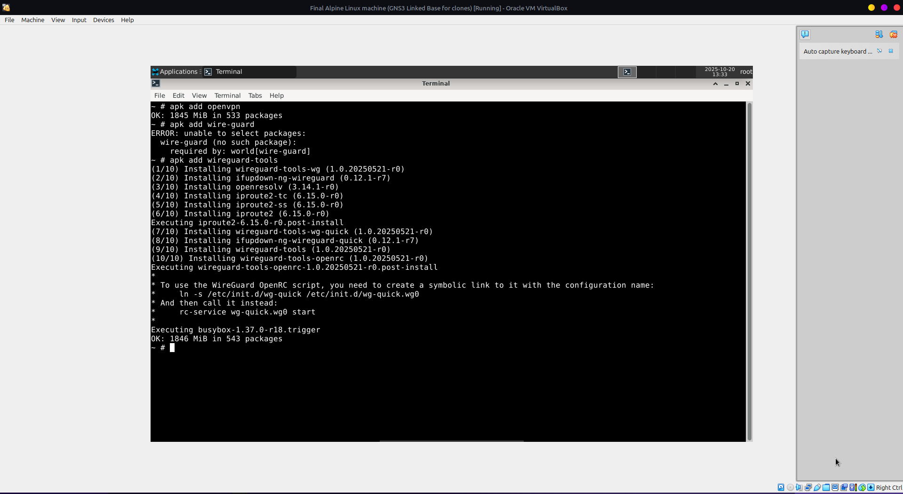

  2. Key generation on Alpine

     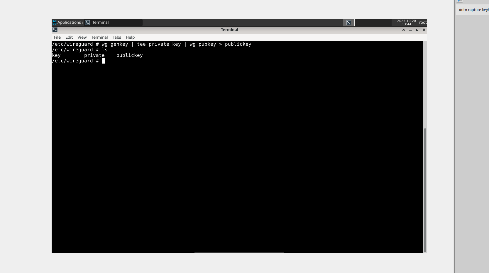

  3. Adding `wg0.conf` on Alpine

     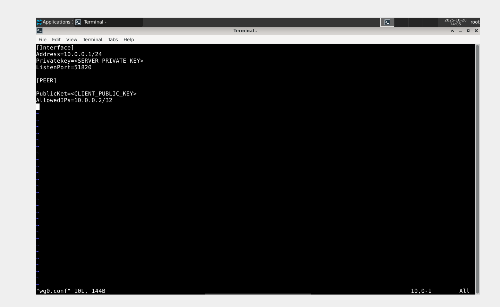

  4. Successful connection on Alpine

     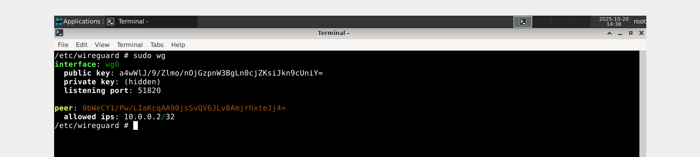

  5. Ping test: server -> client

     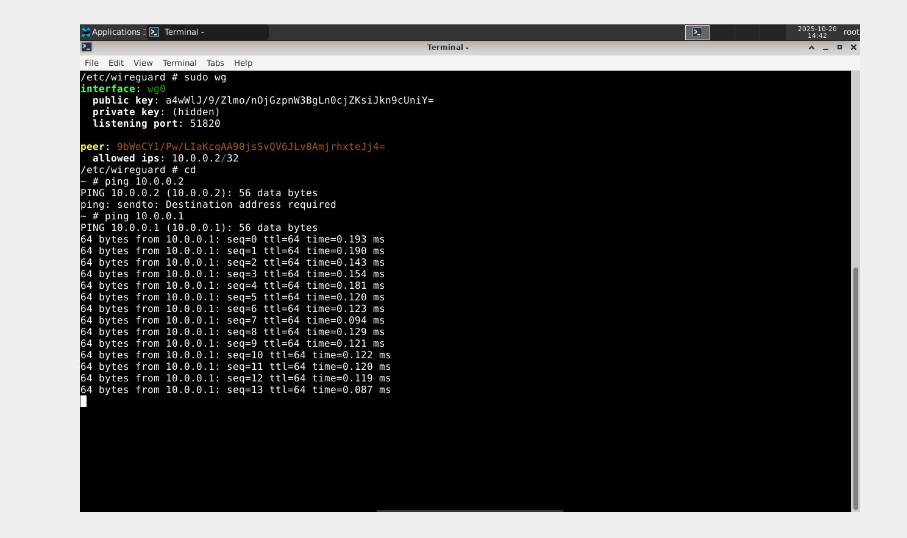

  6. Ping test: client -> server

     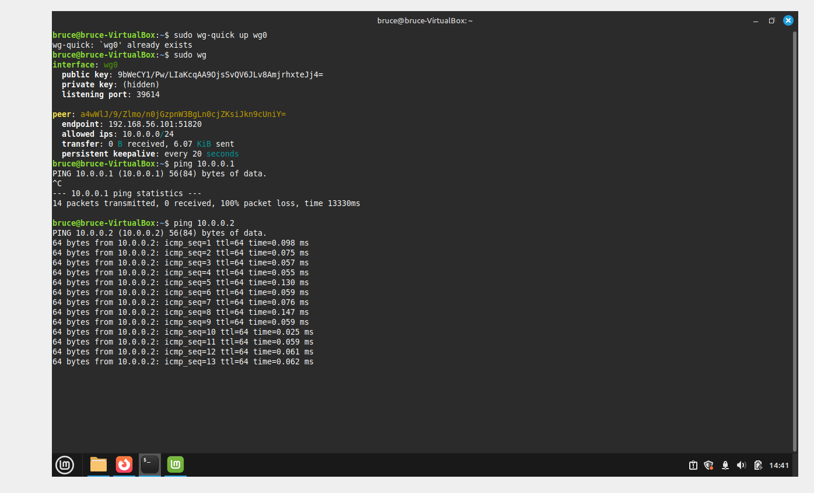

  7. Installation on Linux Mint

     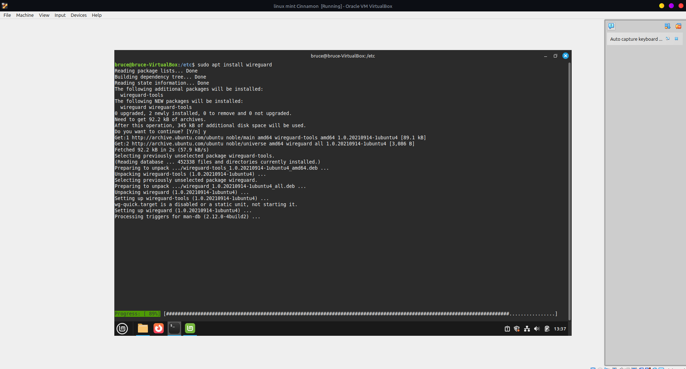

  8. Key generation on Linux Mint

     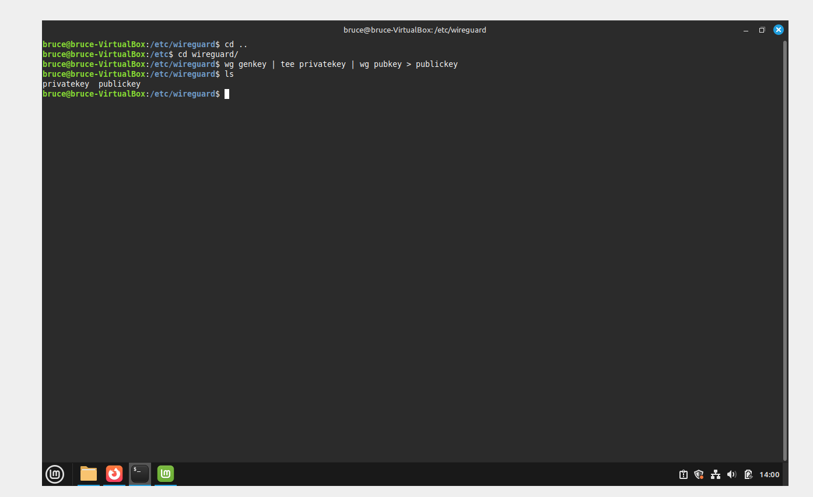

  9. File permission fixes on Mint

     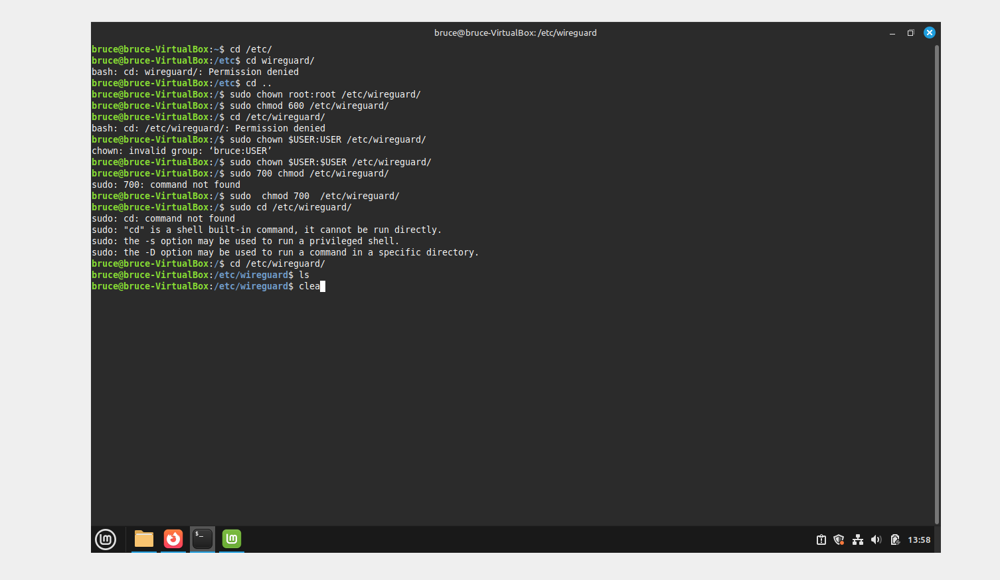

  10. Successful connection on Mint

     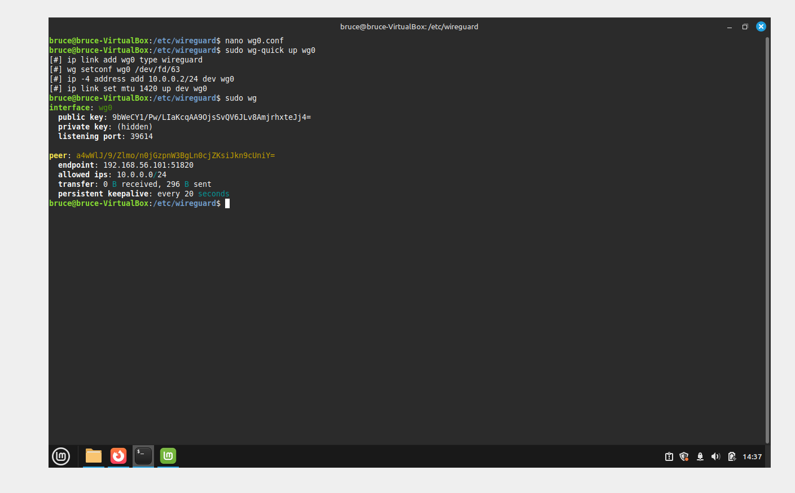

  11. Commands output on Alpine server

     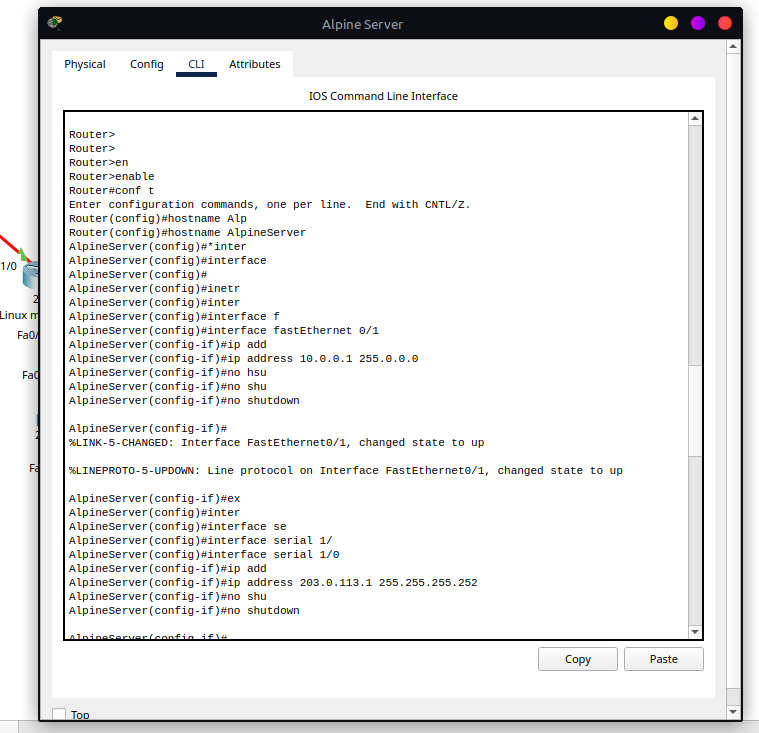

  12. Commands output on Mint server

     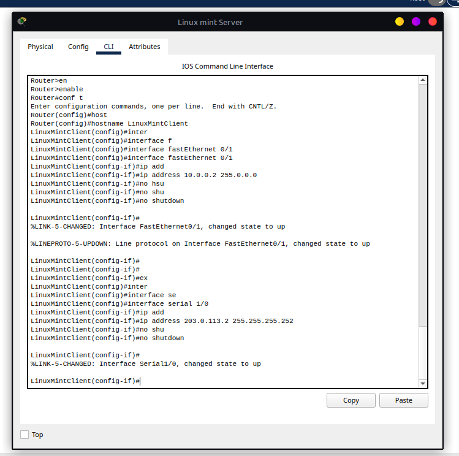

  13. Alpine VPN configuration (file view)

     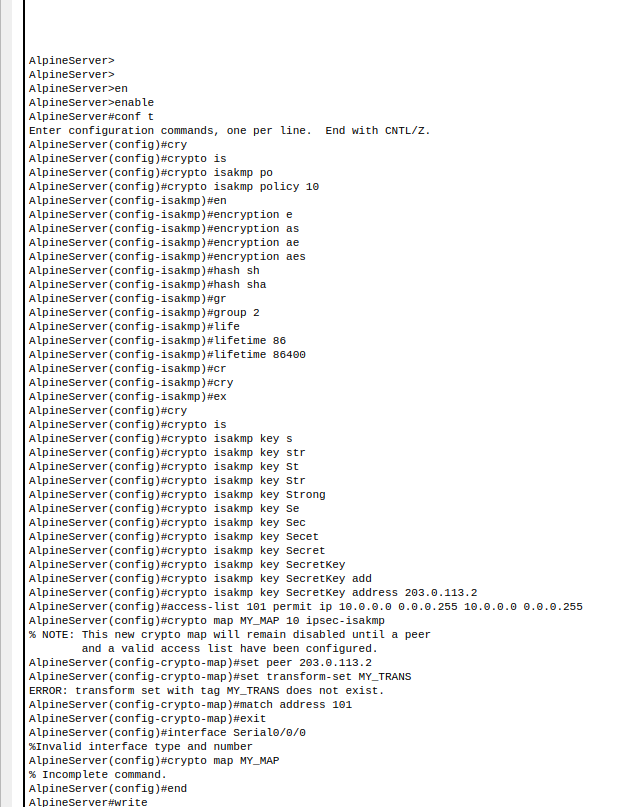

  14. VPN shows up (UI)

     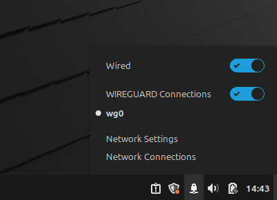

  15. VPN icon / indicator

     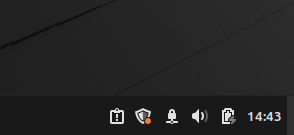

  16. Lab topology / diagram screenshot

     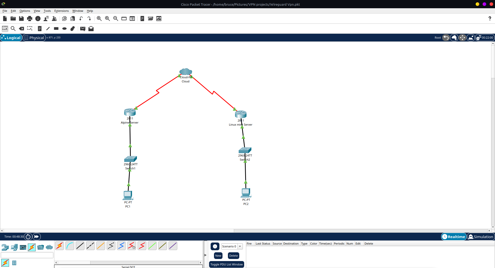

Notes about operating systems

- Alpine Linux — screenshots prefixed or referencing "Alpine" show installation and key generation steps on Alpine. On Alpine the package manager used is `apk` and some kernel modules or packages (depending on the image and kernel) may be required for WireGuard.
- Linux Mint — screenshots prefixed with "LinuxMint" or referencing Mint show equivalent steps on Linux Mint (Ubuntu/Debian family), where `apt` is used.

No PSD / PSF files found

I searched the folder contents and did not find any `.psd` or `.psf` image sources. If you have original editable artwork elsewhere, let me know where it is and I will reference it here.

Quick start (concise) — Alpine and Linux Mint

Alpine (example)

1. Install WireGuard tools:

```bash
sudo apk update
sudo apk add wireguard-tools
```

1. Generate keypair:

```bash
wg genkey | tee privatekey | wg pubkey > publickey
```

1. Create `/etc/wireguard/wg0.conf` with your interface and peer sections (example below).

Linux Mint (example)

1. Install WireGuard tools:

```bash
sudo apt update
sudo apt install wireguard
```

1. Generate keypair (same command as above):

```bash
wg genkey | tee privatekey | wg pubkey > publickey
```

Example interface (wg0.conf)

Replace the placeholders with your private/public keys and IPs.

```ini
[Interface]
PrivateKey = <your-private-key>
Address = 10.0.0.1/24
ListenPort = 51820

[Peer]
PublicKey = <peer-public-key>
AllowedIPs = 10.0.0.2/32
Endpoint = peer.example.com:51820
PersistentKeepalive = 25
```

Bringing the interface up

```bash
sudo wg-quick up wg0
```

Basic troubleshooting

- `sudo wg` — check peer status and transfer counters.
- `ip a` / `ip route` — verify interface addresses and routing.
- Confirm firewall (ufw, nft, iptables) allows UDP to the WireGuard port (default 51820).
- On Alpine, ensure the kernel supports WireGuard or use a compatible kernel package.

Suggested next edits

- Move screenshots into an `images/` directory and link them inline for a richer README.
- Add exported configuration examples (redact private keys) to a `examples/` folder.
- Add a `LICENSE` file if you want to place this work under an open-source license.

If you want me to also commit these changes and push them to the `main` branch, say "Commit and push".

Updated: October 23, 2025


